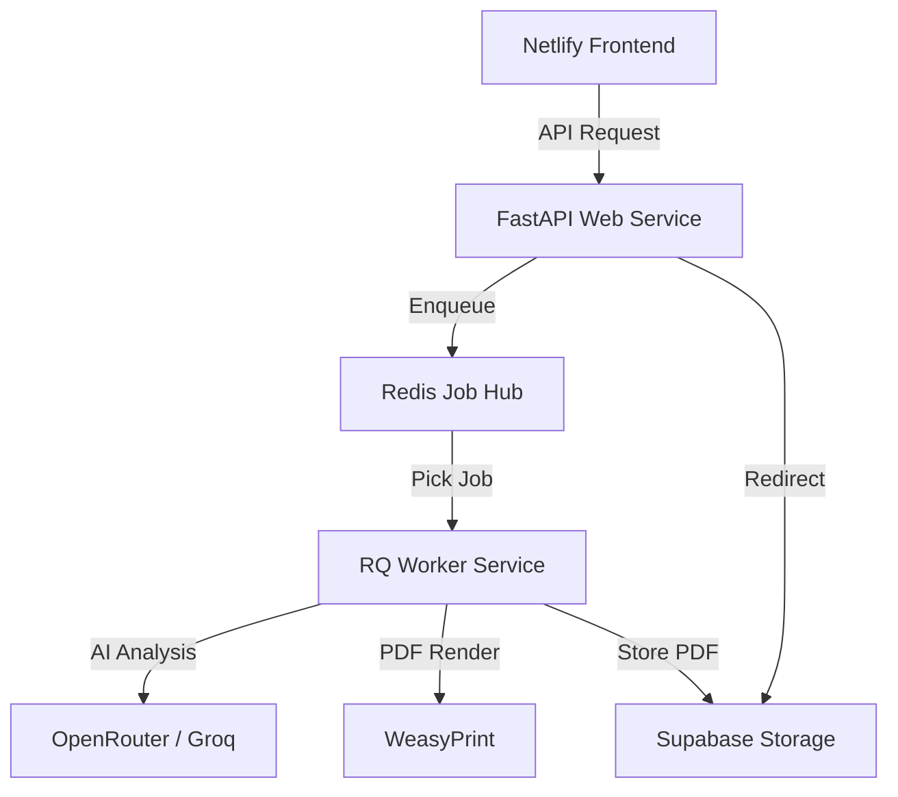

# EresumeHub - Elite Generation 5 Backend (Distributed)

This project is a Python FastAPI server that provides an **Asynchronous, Distributed-safe, and Elite-hardened** Resume Intelligence Engine.

## 🏗️ Generation 5 Architecture (Distributed)
The system has moved from a blocking monolith to a high-performance **Worker-based Architecture**. This allows for massive scalability and zero-downtime AI generation.

## 🚀 Key Elite Features (v3.x)

### 1. Multi-Priority Queue Orchestration (High/Default/Low)
The system separates user-facing operations from background maintenance to ensure zero-latency feedback for the end-user.
- **High Priority**: Resume Generation, AI Analysis, and Section Refinement.
- **Default Priority**: Static PDF rendering, cache warms, and standard exports.
- **Low Priority**: Long-running analytics aggregation, image optimization, and history cleanup.

### 2. Zero-Memory PDF Delivery
We no longer proxy heavy PDF bytes through the API server. Instead, we use **Signed URL Redirects** via Supabase, reducing RAM overhead by ~99% and significantly improving latency.

### 2. Distributed Job Hub (RQ + Redis)
Generation tasks are processed in the background. The API returns a `job_id` immediately, allowing the UI to show real-time progress while the worker handles the heavy lifting.

### 3. Cost-Control Idempotency
Implemented a **SHA-256 Hashing Layer** for request payloads. This prevents duplicate, expensive AI generations within a 5-minute window if the user spams the "Generate" button.

### 4. Operational Visibility
A dedicated `/api/v1/system/stats` endpoint provides real-time health metrics including Redis connectivity, Queue depth, and active worker counts.

## 🛠️ Security & Hardening
- **Zero-Wildcard CORS**: Strict origin validation via `ALLOWED_ORIGINS`.
- **Traceback Masking**: Raw Python errors (exc_info) are sanitized at the API layer to prevent internal leakage.
- **Boot Sequence Guards**: Critical environment loading and validation before service initialization.

## 📦 API Endpoints (Core)

### `POST /api/v1/resume/create`
Initializes a resume generation job. Returns a `job_id`.

### `GET /api/v1/jobs/{job_id}`
Polls for the status of a background job. Returns fine-grained `progress` and `step` metadata.

### `GET /api/v1/system/stats`
(Admin-facing) Returns infrastructure health metrics.

## 🏁 Setup & Deployment

### 1. Environment Configuration
Copy `.env.example` to `.env` and fill in your keys.

### 2. One-Click Deploy (Render.com)
The included `render.yaml` Blueprint automatically provisions:
1.  **Web Service** (main.py)
2.  **Worker Service** (worker.py)
3.  **Redis Instance**

To deploy, simply link your repository to Render using the "Blueprint" feature.

---
### 🏆 EresumeHub 3.x - Production-Elite
*Architected for Scale. Hardened for Security. Polished for DX.*
